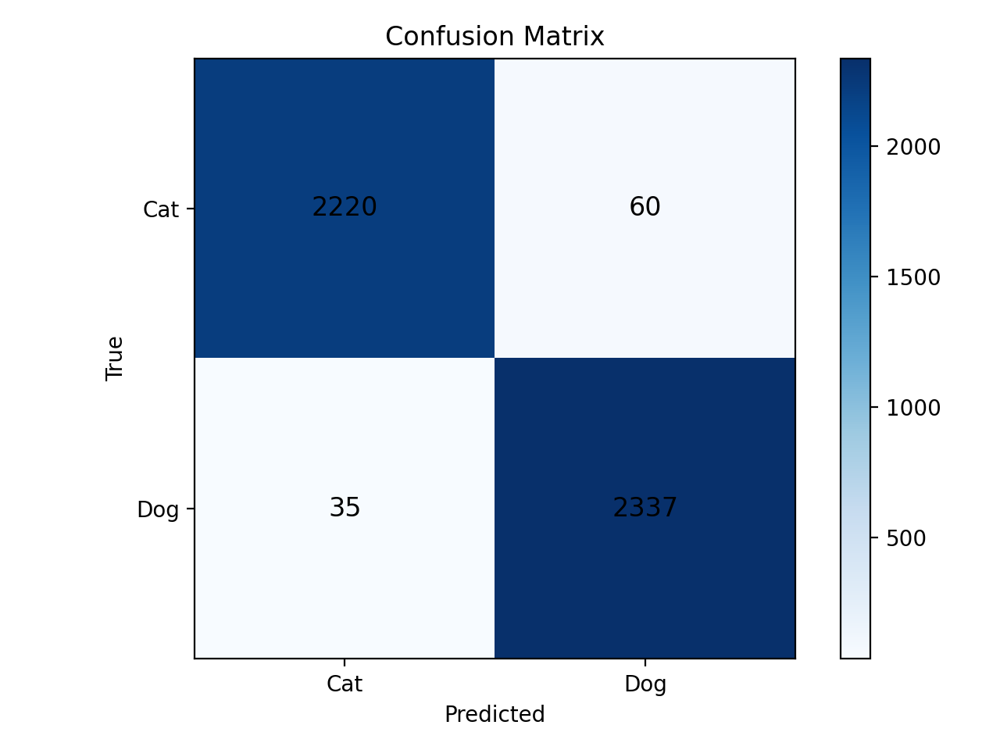
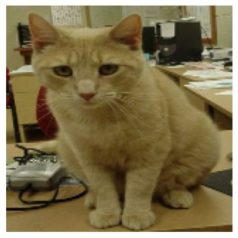
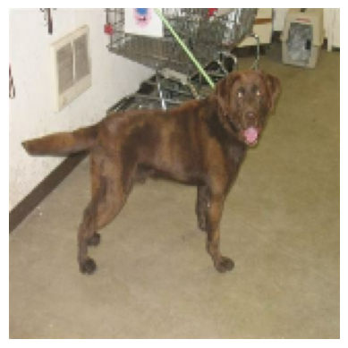

🐱🐶 Cats vs Dogs Image Classification
📌 Project Overview

This project implements an image classification model that distinguishes between cats and dogs using Convolutional Neural Networks (CNNs) and transfer learning with MobileNetV2.
It is designed for both experimentation in Jupyter/Colab notebooks and production-style training via Python scripts.

⚙️ Installation

Clone the repository:

git clone https://github.com/Oghuz20/cats-vs-dogs.git
cd cats-vs-dogs


Create and activate a virtual environment:

python -m venv .venv
# Linux/Mac
source .venv/bin/activate
# Windows
.venv\Scripts\activate


Install dependencies:

pip install -r requirements.txt

🚀 Usage
🔹 Training

Train the model with transfer learning and fine-tuning:

python src/train.py --epochs 5 --finetune_epochs 3

🔹 Prediction (Local CLI)

Prediction (Local CLI)

You can directly use the pre-trained model included in models/ without retraining.  


Run prediction on an image:

python src/predict_local.py --image path/to/your_image.jpg
🔹 Notebook

For interactive exploration and step-by-step workflow, open:

notebooks/cats_vs_dogs_colab.ipynb

📂 Project Structure
cats-vs-dogs/
├─ notebooks/
│  └─ cats_vs_dogs_colab.ipynb        # Interactive notebook (Colab-ready)
├─ artifacts/
│  ├─ confusion_matrix.png             # Model evaluation plots
│  ├─ accuracy_curve.png
│  ├─ loss_curve.png
│  └─ classification_report.txt
├─ models/
│  └─ cats_vs_dogs_mobilenetv2.keras  # ✅ Pre-trained model (included)
├─ src/
│  ├─ train.py                        # Training script
│  ├─ predict_local.py                # Local prediction script
│  └─ utils.py                        # Helper functions
├─ data/.gitkeep                      # Placeholder for raw data
├─ requirements.txt
├─ .gitignore
└─ README.md

📊 Results

The model was trained using MobileNetV2 with transfer learning and fine-tuning.
It achieves state-of-the-art accuracy on the Cats vs Dogs dataset.

✅ Overall Performance

Validation Accuracy: ~98%

Loss & Accuracy Curves: available in artifacts/

Saved Model: models/cats_vs_dogs_mobilenetv2.keras

🔹 Confusion Matrix
<p align="center">  </p>

Cats correctly classified: 2220 / 2280

Dogs correctly classified: 2337 / 2372

🔹 Classification Report
              precision    recall  f1-score   support

         Cat       0.98      0.97      0.98      2280
         Dog       0.97      0.99      0.98      2372

    accuracy                           0.98      4652
   macro avg       0.98      0.98      0.98      4652
weighted avg       0.98      0.98      0.98      4652

🔎 Interpretation

Both precision and recall are very high (>97%), proving reliability for both classes.

F1-score = 0.98 → excellent balance between precision and recall.

Very few misclassifications (~95 total errors out of 4652 images).


## 🖼️ Sample Predictions

Here are some example predictions made by the model:

| Input Image | Prediction | True Label |
|-------------|------------|------------|
|  | 🐱 Cat | 🐱 Cat |
|  | 🐶 Dog | 🐶 Dog |

👉 To reproduce, place test images inside `artifacts/` and run:
```bash
python src/predict_local.py --image path/to/your_image.jpg
```


✅ Key Features

Transfer learning with MobileNetV2


Efficient preprocessing pipeline with tf.data

Separate training + fine-tuning phases

Clear evaluation metrics and visualizations

Easy-to-use CLI for local predictions

📜 License

This project is licensed under the MIT License.
